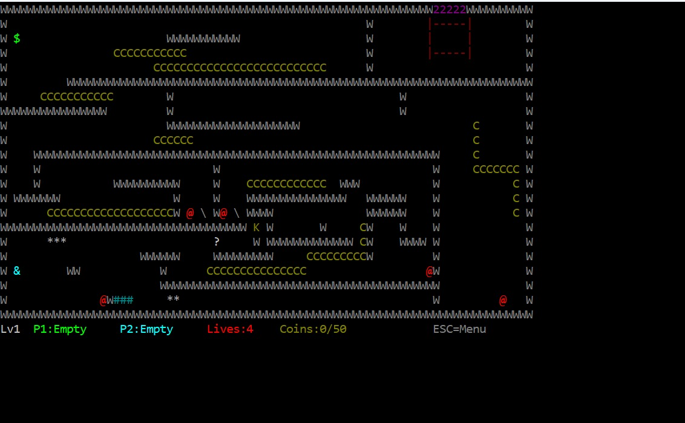
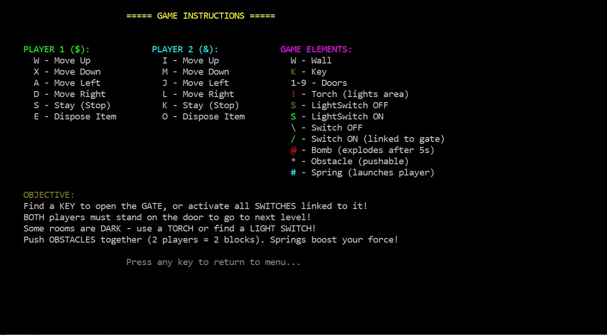
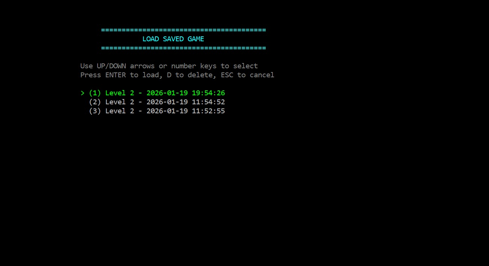
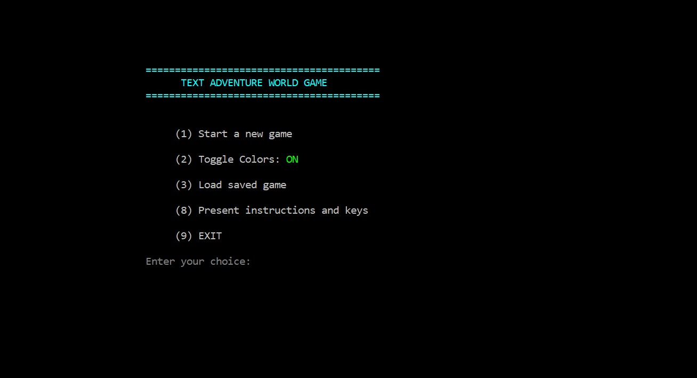
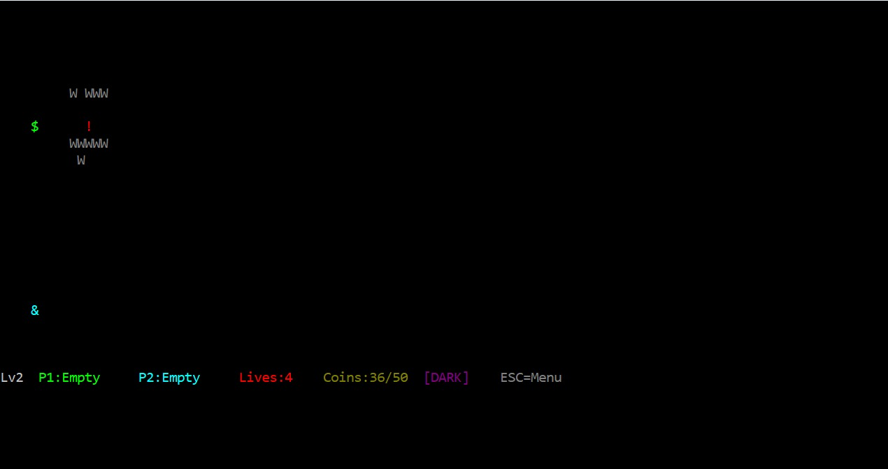
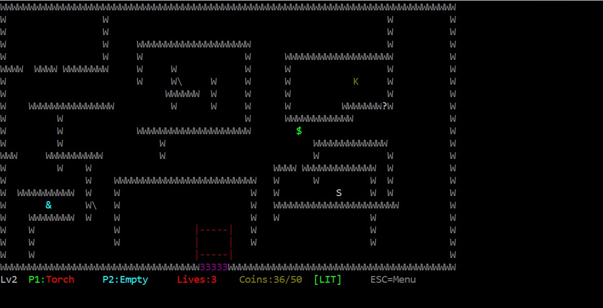
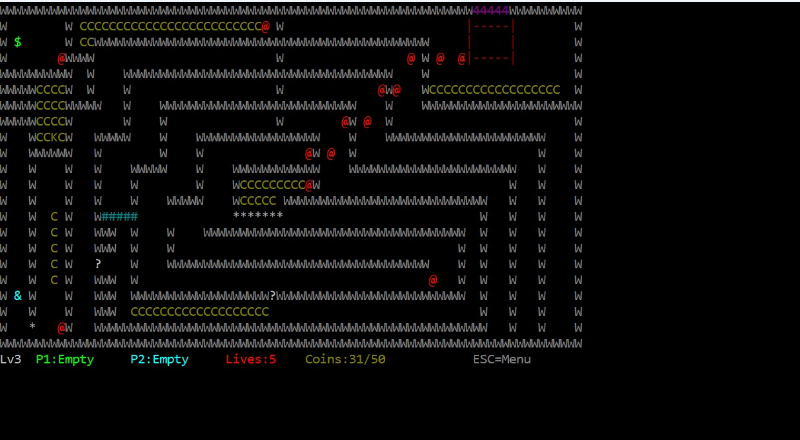
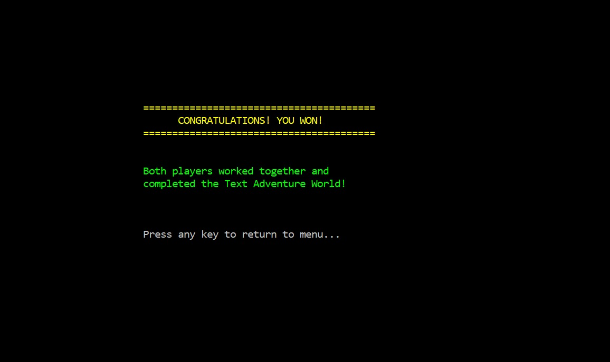

# Text Adventure World

Console-based C++ game for **C++ 2026A – MTA (Exercises)**. Two players navigate interconnected rooms (from external screen files), interact with items, and solve challenges. The game runs in a standard Windows console (80×25), using `gotoxy` for positioning, `_kbhit`/`_getch` for non-blocking input, and `Sleep` for pacing.

---

## Screenshots

**Main menu** — Start new game, toggle colors, load saved game, instructions, exit.

**Game instructions** — Player controls (P1: $, P2: &) and game elements (walls, keys, doors, torch, switches, bomb, obstacle, spring).

**Load saved game** — List of saved states (level + date/time); select with arrows or number keys, ENTER to load, D to delete, ESC to cancel.

**Gameplay** — Level 1: maze, coins goal, two players (P1/P2), lives.

**Gameplay** — Level 2: status bar (Lv2, P1/P2 inventory, lives, coins), dark room indicator, ESC=Menu.

**Gameplay** — Level 2 with torch: P1 holds Torch, [LIT] area, key/coins visible.

**Gameplay** — Level 3: coins progress, walls, collectibles (C), doors and obstacles.

**You won!** — Victory screen when both players complete the adventure.

---

## Environment & Build

- **IDE:** Visual Studio 2022 or later  
- **Language:** Standard C++, C++17  
- **Platform:** Windows, console application  
- **Solution:** `GameProject.sln` at repository root → project `GameProject\GameProject.vcxproj`  
- **Output:** `adv-world.exe` (built as target `adv-world`)

Open the solution in Visual Studio and build (Debug/Release, x86/x64). All sources are under `GameProject/` in subfolders (Core, GameObjects, Systems, UI, Managers); the project includes those directories so `#include "Header.h"` works from any file.

---

## Running the Game

From the directory containing `adv-world.exe` (usually the build output folder):

| Invocation | Behavior |
|------------|----------|
| `adv-world.exe` | Normal mode (Ex2 behavior): menu, new game, load saved state, instructions, exit. |
| `adv-world.exe -save` | Same as normal, but records the game to `adv-world.steps` and `adv-world.result`. Each new game overwrites these files. |
| `adv-world.exe -load` | Playback from `adv-world.steps` and `adv-world.result`. No menu; no user input (including ESC). |
| `adv-world.exe -load -silent` | Same as `-load` but no display and no sleep; only checks that actual result matches expected and prints pass/fail. |
| `adv-world.exe -h` (or `--help`, `-?`) | Print usage. |

All file paths are relative to the **current working directory** (where the exe is run from).

---

## Main Menu (Normal Mode)

- **(1)** Start a new game  
- **(8)** Present instructions and keys  
- **(9)** EXIT  

(If load-from-file is implemented: an option to start from a previous saved state is also in the menu.)

---

## Controls

Input is **case-insensitive**.

| Action | Player 1 | Player 2 |
|--------|----------|----------|
| RIGHT | D | L |
| DOWN | X | M |
| LEFT | A | J |
| UP | W | I |
| STAY | S | K |
| Dispose element | E | O |
| **Pause** | **ESC** | (then ESC again to continue, or **H** to go back to main menu) |

After choosing a direction, the character keeps moving automatically until STAY is pressed or movement is blocked (wall, boundary, etc.). Movement speed is 1 per game cycle unless changed (e.g. by springs).

---

## Game Elements

- **Two players** – Cooperate; each can hold one collectible.  
- **Walls** – Block movement.  
- **Doors (1–9)** – Open with keys/switches; stepping on an open door moves to the linked screen. The game follows the second player who leaves a room when they go to a different room.  
- **Keys** – Collectible; open matching door(s). Key is consumed when used.  
- **Springs** – One or more chars in a row/column against a wall. Player compresses them; on STAY or direction change they release and accelerate the player (speed and duration depend on compressed length).  
- **Torches** – Collectible; illuminate dark areas while held.  
- **Switches (on/off)** – Toggled by stepping on them; can be linked to doors (correct combination opens the door).  
- **Obstacles** – Block movement but can be pushed; force needed = obstacle size. Player force = 1 (or spring speed when launched). Two adjacent players moving the same direction add their forces.  
- **Bombs** – Collectible; when disposed, count 5 cycles then explode (damage walls, objects, players within range; rules may include “shielded by wall”).  
- **Riddles** – Stepping on one shows a riddle; correct answer lets the player pass and removes the riddle; wrong answers can be handled (e.g. stay in place, optional penalty).  

Suggested chars (can be changed and documented in readme/instructions): Players `$` & `&`, Torch `!`, Bomb `@`, Wall `W`, Obstacle `*`, Spring `#`, Switch on/off `/\`, Door `1–9`, Key `K`, Riddle `?`. Legend marker in screen file: `L` (top-left of status area, max 3 lines × 20 chars).

---

## Screens & Files (Ex2 / Ex3)

- **Screen files:** `adv-world*.screen` in the working directory, loaded in lexicographical order (e.g. `adv-world_01.screen`, `adv-world_02.screen`).  
- **Riddles:** `riddles.txt` in working directory; format and link to screen files is defined by the implementation.  
- **Recording (Ex3):**  
  - **Steps:** `adv-world.steps` – list of steps (e.g. direction changes only, no redundant data), with game-cycle “time” per step so playback is deterministic. Optional: store screen file names and/or RNG seed.  
  - **Result:** `adv-world.result` – expected result: time when a player moved to another screen (and which screen), lost a life, got a riddle (riddle, answer, correct/not), and when the game ended with score.  

A separate **files_format.txt** in the repo explains the exact format of the steps and result files.

---

## Project Layout

| Folder | Contents |
|--------|----------|
| **Core** | `main.cpp`, `Game`, `GameBoard`, `GameLevel`, `GameConfig`, `GameStateSaver`, `GameRecorder`, `Point`, `Direction`, `console.h` |
| **GameObjects** | `Player`, `GameObject`, `Wall`, `Door`, `Key`, `Coin`, `Bomb`, `Heart`, `Gate`, `Torch`, `Switch`, `LightSwitch`, `Obstacle`, `Spring`, `DroppedItem`, `Riddle` |
| **Systems** | `CollisionSystem`, `ObjectManager`, `InteractionHandler`, `InputHandler`, `LightingSystem`, `LevelRenderer`, `ScreenParser` |
| **UI** | `BaseScreen`, `MenuScreen`, `PauseMenu`, `EndScreen`, `InstructionsScreen`, `LoadGameScreen`, `StatusBar`, `MessageDisplay` |
| **Managers** | `LivesManager` |

---

## Submission (Course)

- Zip: **code + vcxproj + sln + readme.txt** only. No `DEBUG` folder, no compiled artifacts, no hidden dirs or extra binaries.  
- **readme.txt** must contain the **IDs of all submitters** and any design/decisions you want to explain.  
- If you use GenAI or external code (≥5 lines), add a comment above that block with the source (link, prompt summary, etc.).  
- Bonus features (e.g. colors, extra elements): describe them in **bonus.txt**; if you add colors, the game must also run correctly in a “No Colors” mode selectable from the menu.

---

## Reference

This implementation follows the requirements and guidelines from **C++ 2026A - MTA - Exercises** (Requirements and Guidelines PDF). All three exercises are covered: Ex1 (basic game, menu, core elements), Ex2 (all elements, screen/riddle files, score/lives, error handling), Ex3 (optional save/load state; mandatory `-load`/`-save` with steps and result files, plus `files_format.txt`).
